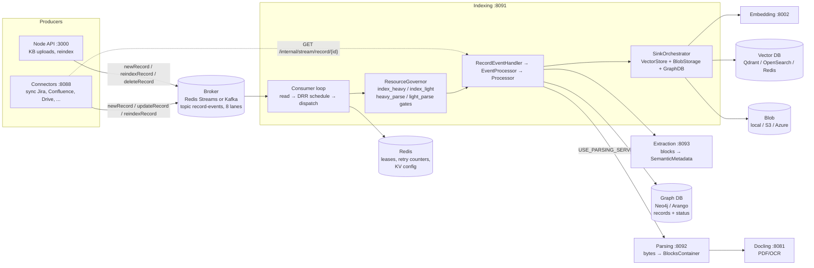
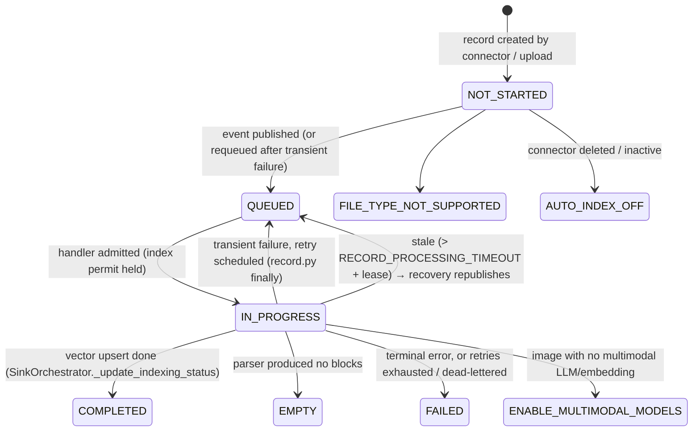
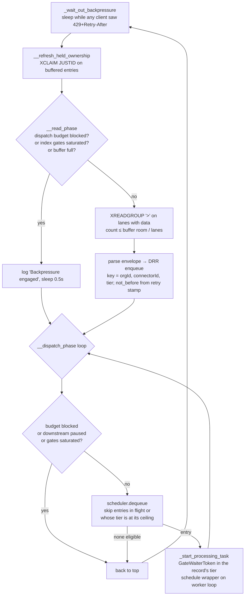

# Indexing Service — Architecture, Data Flow, and Admission Control

This is the working reference for `backend/python/app/indexing_main.py` and everything a record passes through between a `record-events` message and `indexingStatus=COMPLETED`. Read it before changing anything under `app/services/messaging/`, `app/services/resource_governor/`, `app/events/`, or `app/modules/transformers/`.

Section 5 is the root-cause analysis of the "indexing starts fast, then drops to 2–3 records" throughput collapse. If that is why you are here, skip to it, but the mechanism only makes sense with sections 3 and 4.2 in mind.

---

## 1. High-level design

Indexing is one Python process (`app.indexing_main`, port 8091) that consumes record events from the broker, downloads each record's bytes, parses them into a `BlocksContainer`, embeds the blocks into the vector store, stores the blocks in blob storage, and enriches the graph with LLM-extracted metadata. It does not talk to a source system directly: the Connectors service owns source access and streams bytes on request.

Indexing needs a language model configured before records can finish, not only for the enrichment step at the end. The model assigned to the `indexing` role (or the default LLM) is read while records are processed: images check whether it is multimodal, spreadsheets, CSVs and tables in documents are summarised with it while they are parsed, and the inline enrichment step runs inside the same processing call, so its failure fails the record. With no LLM configured, records fail with "No AI model is set up for this workspace yet…" (`app/utils/llm.py::LLM_MISSING_FOR_FILE`), stored as the failure reason as-is.



**Two parsing modes exist.** With `USE_PARSING_SERVICE=false` (the shipped default) the handler parses in-process via `app/events/processor.py` (`Processor.process_*`), which itself calls the Docling service for PDF layout. With `USE_PARSING_SERVICE=true` it POSTs the bytes to the Parsing service. Both paths yield the same three pipeline events to the consumer (`START_PARSING`, `PARSING_COMPLETE`, `INDEXING_COMPLETE`), which is what the admission control below keys on.

**One worker thread.** The consumer runs a second event loop on a dedicated thread. Broker I/O (XREADGROUP/XACK, Kafka poll/commit, producer sends) stays on the main loop; every record's handler, the governor gates, the Neo4j driver, the lease renewer and the recovery loops run on the worker loop. Anything that must cross loops goes through `consumer_concurrency.bridge_to_main_loop`. The producers do that for themselves: `RedisStreamsProducer` and `KafkaMessagingProducer` remember the loop they were started on and hand a send from any other loop back to it (`app/utils/loop_bridge.run_on_loop`), so a handler on the worker loop can call them directly. Redis clients that both loops use directly are held one per loop (`app/services/redis/loop_clients.LoopBoundClients`): `RedisClientRegistry` for leases and retry counts, and the accessible-records cache, which the worker loop invalidates when a knowledge-base record finishes indexing.

**Parse workers.** Parsing a large text, code or CSV file is seconds of CPU, and on the worker loop that is seconds in which no other record's graph, vector or embedding call can make progress. Those parses run in separate worker processes owned by `app/modules/parsers/parse_pool.py`; section 4.7 says which step runs where and why a thread is not enough. The parsing service uses the same pool for the same parsers.

Related services and ports are listed in `AGENTS.md`.

---

## 2. Record lifecycle and data flow

### 2.1 Status state machine

Status lives on the record node in the graph (`records` collection) as three fields: `indexingStatus`, `parsingStatus`, `extractionStatus`, plus `processingStartedAt` and `reason`. A primary whose queued md5-duplicates were just promoted also carries `duplicateReconcilePending` until their taxonomy edges and entity membership have been copied (see `docs/entity-resolution.md`).



`extractionStatus` moves independently (`NOT_STARTED → IN_PROGRESS → COMPLETED | FAILED`) and never blocks searchability: a record is searchable as soon as `indexingStatus=COMPLETED`.

### 2.2 Data flow for one record (happy path)

```mermaid
sequenceDiagram
    autonumber
    participant Br as Broker (lane stream)
    participant Main as Consumer main loop
    participant W as Worker loop task
    participant Gov as ResourceGovernor gates
    participant Red as Redis (leases)
    participant Hnd as RecordEventHandler / EventProcessor
    participant Conn as Connectors :8088
    participant Prs as Parser (in-proc or :8092)
    participant Sink as SinkOrchestrator
    participant G as Graph DB
    participant V as Vector DB + Blob

    Br->>Main: XREADGROUP (batch ≤ buffer room)
    Main->>Main: parse envelope, DRR enqueue by (orgId, connectorId)
    Main->>Main: dispatch phase: dequeue while waiters < pending ceiling
    Main->>W: run_coroutine_threadsafe(_process_message_wrapper) + GateWaiterToken
    W->>W: retry backoff? PEL ownership check, per-process record claim
    W->>Gov: acquire INDEX_HEAVY or INDEX_LIGHT permit (tier from payload ext/mime)
    Gov-->>W: admitted → token.admit() (waiter count −1)
    W->>Red: lease "indexing" (cluster cap) + lease "record:<id>" (exclusivity)
    W->>Hnd: process_event(message)
    Hnd->>G: get record, connector active?, supported type?
    Hnd->>Conn: stream bytes (signed URL or /internal/stream/record)
    Hnd->>G: md5 dedup lookup; parsingStatus/indexingStatus = IN_PROGRESS
    Hnd-->>W: yield START_PARSING(tier, size_bytes)
    W->>Gov: acquire HEAVY_PARSE or LIGHT_PARSE permit (bounded wait, clock paused)
    W->>Red: lease "parsing" / "parsing:light"
    Hnd->>Prs: parse → BlocksContainer
    Hnd-->>W: yield PARSING_COMPLETE → release parse permit + lease
    Hnd->>Sink: index(ctx): describe images, blob write, embed + upsert
    Sink->>V: upsert points / store blocks
    Sink->>G: indexingStatus = COMPLETED
    Hnd->>Hnd: enrich: extraction LLM → graph metadata (extractionStatus)
    Hnd-->>W: yield INDEXING_COMPLETE → release index permit + lease
    W->>Main: XACK (bridged), clear retry counters
```

Failure paths from the same wrapper (`redis_streams/indexing_consumer.py::_process_message_wrapper`, mirrored in the Kafka consumer):

| Outcome | What happens |
| --- | --- |
| Terminal exception (`MessageErrorClassifier` → TERMINAL) | Record marked FAILED via the disposition sink, message ACKed. |
| Transient exception, attempts < `MAX_DELIVERY_ATTEMPTS` (3) | Record reverted `IN_PROGRESS → QUEUED`, message re-published to the same lane with `_retry_not_before` (15s, 60s, 240s backoff) and `_retry_tracking_id`, original ACKed. |
| Transient, attempts exhausted | Dead-lettered: record FAILED, message ACKed, next MD5 duplicate triggered. |
| `ParseAdmissionTimeout` (no parse slot within `RECORD_PROCESSING_TIMEOUT`) | Re-queued **without** counting an attempt; delivery counter bounds it (`REDIS_MAX_DELIVERIES`). |
| `RECORD_PROCESSING_TIMEOUT` (1800s) elapsed inside the handler | Task cancelled, handler leaves the record IN_PROGRESS, counted as a transient failure. |
| Lease lost (renewer could not prove ownership) | Handler cancelled, message left un-ACKed for redelivery. |
| Process crash | Entry stays in the PEL; `XAUTOCLAIM` after `claim_min_idle_ms`, and the stale-record scan republishes IN_PROGRESS records older than ~32 min. |

---

## 3. Light and heavy documents

Every record is classified once, from the event payload's `extension` and `mimeType`, by `app/services/resource_governor/tiers.py::classify`:

| Tier | Formats | Why it is separate |
| --- | --- | --- |
| **HEAVY** | pdf, doc/docx, ppt/pptx, xls/xlsx, png/jpg/jpeg/webp/svg, and **anything unrecognised** | Docling layout analysis, OCR, LibreOffice, VLM image description: CPU-bound for minutes, ~1.5 GiB RSS per parse. |
| **LIGHT** | txt, md, html, csv/tsv, json/yaml, source code, `application/blocks` (Jira/Confluence/Slack-shaped payloads), `text/gmail_content` | Milliseconds of CPU on a few KB; wall time is I/O (embedding, graph, vector writes). The exception is a large text, code or CSV file, which is seconds of CPU: from 256 KiB up those parse steps run in a parse worker process when the process has a pool (section 4.7); JSON, YAML and HTML stay on threads at any size. |

Jira issues and Confluence pages are published as `application/blocks` (Jira) or blocks/HTML (Confluence), so they are LIGHT. Their **attachments** are published with the attachment's real media type: PDFs, screenshots, Office files. Those are HEAVY. A Jira/Confluence sync is therefore a mixed stream: mostly light records with a heavy minority interleaved. That mix is the precondition for the bug in section 5.

The tier decides four things, all in `consumer_concurrency.py` and `resource_governor/`:

1. **Which index pool** the record holds for its whole lifetime: `Pool.INDEX_HEAVY` or `Pool.INDEX_LIGHT` (`acquire_index_slot`). This permit is taken before the handler runs and released on `INDEXING_COMPLETE`, so it covers download, the wait for a parse slot, parsing, embedding, and enrichment.
2. **Which parse pool** the record waits on at `START_PARSING`: `HEAVY_PARSE` or `LIGHT_PARSE`, cost 2 permits for a heavy file over 25 MiB.
3. **Which cluster-wide Redis lease** it takes: `parsing` vs `parsing:light` always; `indexing` vs `indexing:light` only once `INDEXING_SPLIT_LEASE_POOLS=true`.
4. **The ceilings and floors** the governor sizes each pool with (section 4.3).

The tier also decides two things at the dispatch layer (added by the fix in section 5.8):

5. **Which read-ahead bucket** a spawned task counts in: `GateWaiters` keeps one count per tier, and `DispatchBudget` gives heavy its own ceiling (2× the current `INDEX_HEAVY` limit, at least 8) under the shared total.
6. **Which leaf of the fairness tree** the message is buffered in: the fairness key is `(orgId, connectorId, tier)`, so a connector's heavy and light records are sibling queues and DRR can pass over a blocked heavy head.

The tier does not influence the lane a message lands in (a lane belongs to a connector, section 4.9) or the read-phase read-ahead, which is bounded by buffer room.

---

## 4. Low-level design

### 4.1 Consumer loop

`IndexingRedisStreamsConsumer._consume_loop` (Kafka: `IndexingKafkaConsumer`) with fair scheduling on (the default):



Key structures:

- **`DRRScheduler`** (`scheduling/drr_scheduler.py`): hierarchical deficit round robin over `(orgId, connectorId, tier)`; the tier level is appended by `TieredKeyExtractor` and enabled by `FairSchedulerConfig.tier_level` (on by default). Each leaf is a FIFO. `try_pop` only inspects the *head* of each leaf; a head that is not eligible is skipped without spending deficit, which is what lets a connector's light leaf proceed while its heavy leaf is blocked. Buffer bounded by `FAIR_SCHEDULING_MAX_BUFFER` (2000) and `FAIR_SCHEDULING_MAX_PER_ENTITY` (500 per connector across both tiers; `entity_key()` gives the prefix the cap applies to).
- **Lanes**: on Redis Streams, the `record-events.0..7` streams (`FAIR_SCHEDULING_LANE_COUNT`); on Kafka, the partitions of `record-events` (32 on a topic created by a new install, `KAFKA_TOPIC_PARTITIONS` to change it; an existing topic keeps its count). On Redis each connector is given one lane, the least busy, and the choice is recorded in Redis (section 4.9). On Kafka the partition is a hash of `connectorId`, so two connectors can share one. On Redis, a lane whose entries are parked for lack of buffer room is skipped while another lane is producing. On Kafka, the consumer reads past a connector at its cap and remembers only positions (below).
- **Held entries / PEL**: buffered entries stay un-ACKed; ownership is refreshed with `XCLAIM JUSTID` so they are neither stolen nor counted as failed deliveries. Idle drains (`_drain_pending`) run only after 3 consecutive empty polls.
- **Retry counters** (`RetryManager`, Redis): `messaging:retry:<stable id>` counts processing failures; `messaging:deliveries:<stable id>` counts hand-backs. Both are separate from Redis's own `times_delivered`, which is only a poison-message backstop (`REDIS_MAX_DELIVERIES`, 10).
- **Connector-off filter** (`ConnectorOffFilter`, `messaging/connector_off.py`; implemented by `app/modules/indexing/connector_off_events.py::GraphConnectorOffFilter`): every batch the read phase reads goes through it before anything is buffered. See "Events of turned-off and removed connectors" below.

#### Reading past a connector at its cap (Kafka)

Two connectors can share a partition. When one of them has a large backlog at the head of it, its first `FAIR_SCHEDULING_MAX_PER_ENTITY` (500) messages fill its share of the buffer. Before, its further messages were then parked in memory with their whole payload, counted against `FAIR_SCHEDULING_MAX_BUFFER` (2000), and once that was full the partition was seeked back and paused. The other connector's messages further down the same partition were not read until the backlog drained, and the scheduler, fair as it is, never saw them. With the default of one partition (below), that was every connector on the install.

Now a message whose connector is at its cap, or whose connector already has remembered messages (so each connector's own order stays oldest-first), is remembered by position only: partition and offset (`kafka/consumer/remembered.py::RememberedOffsets`). Reading carries on, so later messages of other connectors reach the buffer and DRR interleaves them. While positions are remembered the consumer reads up to 1,000 messages a pass (they cost a position, not buffer room) and polls with the short timeout.

- **Fetch-back.** When a connector's buffered count has dropped by half its cap (or by all it has remembered), its oldest remembered messages are read back, up to 500 a pass, by a second consumer of its own (`OffsetFetcher`): assigned partitions by hand, `group_id` None, so it never joins the group, never commits, and never moves the main consumer's position. The fetch runs in the background; its results are buffered on a later pass, through the connector-off filter like any read.
- **Watermark.** A remembered offset stays tracked in `PartitionOffsetTracker` as buffered (no dwell clock), so the commit never passes it and the dwell sweep never force-commits past it. The stranded-record sweep therefore reads it as not finished (the partition's committed offset is at or below it), and does not re-send its record.
- **Budget.** `FAIR_SCHEDULING_MAX_REMEMBERED_POSITIONS` (200,000) across every connector, about 145 bytes each with its watermark entry (measured: 28.7 MB at 200,000). Past it a lane whose next message belongs to a connector with remembered messages, or at its cap, is seeked back and paused as before, and is not resumed until a fetch-back has freed a position. `0` restores parking.
- **Rebalance.** Positions on a revoked partition are forgotten in the revocation callback, before the new owner starts; it reads them from the committed offset, which is at or below the oldest of them. Fetched-back positions stay remembered through every await (the parse, the connector-off filter), so a revocation during one forgets them like any other; they are taken off the queue only in a synchronous step afterwards, from the head, and only while the partition has not been revoked since the last poll. A message that fails to parse on fetch-back stays remembered and is retried; a commit that fails while resolving deleted or settled offsets is carried by the next one. Any delivery resolved on a partition revoked since the last poll is not marked or committed, since its watermark was just cleared (this also closes a gap the poison-message path had on main).
- **Retention.** An offset below the partition's first retained offset, or one a fetch steps over, has been deleted. It is resolved in the watermark and logged (`N remembered message(s) were deleted by Kafka retention …`); its record is still waiting, and the stranded-record sweep re-sends it once the partition has been committed past its queue time. Nothing stalls.
- **Restart.** Positions are not persisted. A restart re-reads from the committed offset, which is at or below the oldest remembered offset, so everything after it is read again, including messages of other connectors that were already indexed. Those take the handler's "already indexed" path: a dispatch slot, the record lease and one graph read each, but no download, parse or embedding. With the reported shape (200,000 remembered messages of one connector and, say, 20,000 indexed meanwhile from others) that is the 200,000 remembered again, at read speed and no payload held, plus 20,000 cheap skips.

The partition count is what limits how many connectors can be kept apart at all. The Node admin service creates `record-events` with 32 partitions on a new install (`KAFKA_TOPIC_PARTITIONS`, a positive whole number, overrides it). An existing topic is never grown by that default; it is grown only when `KAFKA_TOPIC_PARTITIONS` is set to a valid value, because growing moves connectors between partitions once. The `KAFKA_CREATE_TOPICS` lines in the Compose files are not read by the `confluentinc/cp-kafka` image (it starts with no topics); they now say 32 too, to match. Redis Streams keeps the earlier behaviour (parking within the buffer): there, a remembered entry would stay in the consumer's pending list, and keeping 200,000 of them from being claimed as idle costs a full ownership refresh every 10 seconds.

#### Events of turned-off and removed connectors

The handler skips a `newRecord`, `updateRecord` or `reindexRecord` whose record's connector is turned off (it writes `indexingStatus=AUTO_INDEX_OFF`, `reason=CONNECTOR_OFF`) or removed (it writes nothing). Before, each of those events still took a buffer slot, a dispatch slot and an index permit on its way to being skipped, so a turned-off connector's backlog was worked through one record at a time, and anything behind it on the same lane waited for it.

The read phase now settles them as it reads them, on both brokers. For each batch the filter:

1. Picks the record events whose connector is not known to be on. "On" is remembered for `INDEXING_CONNECTOR_STATE_REFRESH_SECONDS` (15s), so a batch of live connectors' events costs no graph call. "Off" and "removed" are never remembered: they are read afresh (one query for the batch's connectors) before anything is settled, so a connector turned back on takes effect on the next batch and the sync it starts is indexed.
2. Reads those events' records in one query and decides each one with `read_time_outcome`, which replays the handler's own steps in the handler's order (the handler calls the same functions, so the two cannot drift; `tests/unit/modules/indexing/test_connector_off_events.py` runs the real handler on the same records to prove it). An event is settled only when the skip is all the handler would do with it.
3. Marks the turned-off ones `AUTO_INDEX_OFF` / `CONNECTOR_OFF` with the handler's fields (`extractionStatus` kept, `parsingStatus` mirrored if it was `IN_PROGRESS`, `processingStartedAt` cleared, the reason), in one conditional statement for the batch (`IGraphDBProvider.update_nodes_fields_if_match`): each record is written only while it still holds the `indexingStatus` the read saw, because the filter does not hold the record's lease. A record another delivery has moved on since keeps its message and is left to that delivery. The connectors are then read once more: if one was turned back on in the meantime, its records get their fields back (conditionally on still holding what was written) and their events take the normal path, because turning a connector on does not re-queue records marked not indexed. The consumer acknowledges what was settled: one `XACK` per stream on Redis; on Kafka the offsets are tracked and marked done in the commit watermark, with one commit per partition. Settled messages behind a Kafka seek-back are not resolved; they are read again and settle again with the same write.

Never settled, always left to the handler: the vector-store rebuild (`vectorDbOnly`, which deliberately re-embeds turned-off connectors from blob), a record whose enrichment was cut short (the handler ends it and releases its copies), an `updateRecord`/`reindexRecord` of a type that is not reconciled block by block (the handler deletes its embeddings first), a record that is `COMPLETED`, `EMPTY` or `ENABLE_MULTIMODAL_MODELS` (its copies are released on that status, by this event or by another event of the same record still buffered), every event of a record when any event of it in the same batch goes to the handler (the handler runs them in order, and settling one first would change what the other finds), a record `IN_PROGRESS` or in flight in this process (another delivery may hold its lease), a missing record of a connector that is only turned off, uploads, and every other event type (deletes, bulk deletes, membership syncs). A trashed record, or a missing record of a removed connector, is acknowledged with no write, as the handler does.

If a connector or record read fails or takes longer than 3s, or the status write fails, nothing in that batch that needed it is settled and the filter stands aside for 30s (or the refresh period, if longer), so an unreachable graph costs the read loop one timeout per pause rather than one per batch. Each read pass that settled anything logs one line, `Acknowledged N queued event(s) of turned-off or removed connectors without indexing them: <connector>=<count> …`, and counts them in `pipeshub_indexing_connector_off_settled_total{broker}`. Read-time settling applies with fair scheduling on (the default); `INDEXING_CONNECTOR_STATE_REFRESH_SECONDS=0` turns it off.

Turning a connector back on does not re-queue its `AUTO_INDEX_OFF` records, now or before this change: the toggle starts an incremental sync, which skips records in that status. They are indexed again by **Manual index** on the connector (a reindex of `AUTO_INDEX_OFF` records), a per-record or per-folder reindex, or a later change to the item at its source.

### 4.2 Admission control layers

A record passes through these, in order. Each is a separate limiter with its own counter; only the ones marked "per tier" know about heavy vs light.

| # | Layer | Where | Scope | Per tier? | What it bounds |
| --- | --- | --- | --- | --- | --- |
| 1 | Scheduler buffer | consumer | process | no | messages read ahead of dispatch (2000 total, 500 per connector) |
| 2 | **Dispatch budget** (`dispatch_budget` / `pending_task_ceiling`) | `consumer_concurrency.py` | process | yes | tasks spawned but not yet admitted through an index gate. Total `max(64, min(256, 2 × (index_heavy limit + index_light limit)))` (or `MAX_PENDING_INDEXING_TASKS`); heavy additionally capped at `max(8, 2 × index_heavy limit)`; light bounded by the total only. Without a scheduler (fair scheduling off) every tier gets the total |
| 3 | `index_gates_saturated` | `consumer_concurrency.py` | process | both-tiers-AND | stops reads/dispatch only when **both** index gates are full |
| 4 | Index gate (`INDEX_HEAVY` / `INDEX_LIGHT`) | `resource_governor/gate.py` | process | yes | records in flight per tier (permit held download → vector upsert) |
| 5 | Distributed `indexing` lease | Redis | cluster | only with `INDEXING_SPLIT_LEASE_POOLS` | fleet-wide in-flight cap at the resolved ceiling |
| 6 | Per-record `record:<id>` lease + in-process claim | Redis / consumer | cluster | n/a | one delivery of a record at a time |
| 7 | Parse gate (`HEAVY_PARSE` / `LIGHT_PARSE`) | `gate.py` | process | yes | concurrent parses; heavy also throttled by a `StartRateLimiter` (≥0.5 admits/s) |
| 8 | Distributed `parsing` / `parsing:light` lease | Redis | cluster | yes | fleet-wide parse cap |
| 9 | Parse admission wait | `parse_admission_wait` | record | n/a | how long a record may queue for a parse slot (`RECORD_PROCESSING_TIMEOUT`) with its own clock paused |
| 10 | `BackpressureCoordinator` | `messaging/backpressure.py` | process | no | pauses all reads/dispatch while any downstream client saw `429 + Retry-After` |
| 11 | `CircuitBreaker` per HTTP client | `services/base_client.py` | process | no | fails fast for 30s after 5 consecutive failures to parsing/extraction/docling |
| 12 | Record processing timeout | wrapper | record | n/a | 1800s of active processing (queue time excluded) |

`GateWaiterToken` is the counter behind layer 2, one bucket per tier (`GateWaiters`). It is incremented synchronously in `_start_processing_task`, in the tier `dispatch_tier` resolves from the envelope, and decremented either when `acquire_index_slot` returns (`admit()`) or when the task ends without ever being admitted (`release()`). Between those two points the task is parked in the index gate's FIFO. The dispatch phase asks `DispatchBudget.allows(tier)` per buffered entry and DRR skips a leaf whose tier is at its ceiling without charging it; reads pause only when `DispatchBudget.blocked` (no tier may spawn), the buffer is full, or both index gates are saturated. Counts are reset when the worker loop stops, so a restart never inherits phantom waiters.

### 4.3 ResourceGovernor

One instance per process (`indexing_main.py` lifespan). It resolves **ceilings** once at startup (`policy.resolve_ceilings`) and adapts **limits** between a floor and that ceiling every 15s (`policy.next_limits`). Gates admit against the current limit; leases are sized from the ceiling.

Ceiling derivation with defaults (`MAX_CONCURRENT_*` unset), `cpus` = cgroup quota, embedding reservation on when a local CPU embedding model is configured:

```
heavy_cpus         = cpus − min(2, 0.25 × cpus)          # embedding reservation
heavy_parse        = floor(heavy_cpus × 1.0)
light_parse        = min(floor(cpus × 10), 256)
index_heavy        = clamp(2 × heavy_parse, ≥ min(8, heavy_parse), ≤ 512)
index_light        = clamp(2 × light_parse, ≥ 8, ≤ 512)
total              = clamp(6 × cpus, 24, 96)             # or MAX_CONCURRENT_INDEXING
if index_heavy + index_light > total:
    index_heavy    = min(index_heavy, total − min(8, index_light, total/2), 2/3 × total)
    index_light    = min(index_light, total − index_heavy)
heavy_parse        = min(heavy_parse, index_heavy);  light_parse = min(light_parse, index_light)
```

Worked examples (what most self-hosted installs run):

| Host | heavy_parse | light_parse | index_heavy | index_light | warm-start limits (h_parse / l_parse / idx_h / idx_l) | gate-waiter ceiling |
| --- | --- | --- | --- | --- | --- | --- |
| 4 CPU, local embeddings | 3 | 18 | 6 | 18 | 2 / 9 / 3 / 9 | **64** |
| 4 CPU, `MAX_CONCURRENT_INDEXING=24`, no reservation (unit-test governor) | 4 | 16 | 8 | 16 | 2 / 8 / 4 / 8 | **64** |
| 8 CPU, local embeddings | 6 | 36 | 12 | 36 | 2 / 18 / 6 / 18 | **64** |
| 16 CPU, local embeddings | 14 | 68 | 28 | 68 | 2 / 34 / 14 / 34 | 96 |

Note the heavy parse pool always **starts at 2** regardless of host size, and only grows one step per 15s sample while memory pressure is under `GOVERNOR_MEM_SOFT` (70% raw) and the pool shows demand. `heavy_memory_cap = free_GiB / 1.5` can hold it at 1 on a crowded all-in-one container.

Control law per pool (`policy._next_pool_limit`), every sample:

1. Shrink if raw memory ≥ 80% (halve), ≥ 70% or CPU brake (−1, CPU brake applies to heavy parse only), downstream incident on index pools (halve), ≥ 2 downstream timeouts (×0.75), or the live memory target is below the current limit (index pools halve the gap).
2. Otherwise grow one slow-start step (doubling while the previous grow's resource delta was small) if memory < 70%, not cooling down (30s after a shrink, 60s after an incident), the pool showed demand (≥ 70% utilisation for heavy, ≥ 30% for light/index, or any blocked acquire), and, for index pools, no downstream hold-off and mean hold time < 2× its low-water baseline.

Floors: heavy parse 2; light parse and both index pools half their ceiling as the *warm-start* width, but the index pools may be braked down to a memory-derived `pressure_floor` (heavy 2 records, light `int(2 × 0.15 / 0.02) = 15` records, or half the ceiling if smaller). A light pool therefore never drops below roughly 8–15 on any host. Governor state is exposed on `GET /health` under `resource_governor` (limits, in_use, ceilings, demand, downstream feedback).

Downstream feedback (`resource_governor/feedback.py`) is fed by `BaseServiceClient` (timeouts, 429s, exhausted retries), the Neo4j client (pool exhaustion), and the lease Redis client. It only ever shrinks or holds the index pools.

### 4.4 Handler chain

`RecordEventHandler.process_event` (`kafka/handlers/record.py`) → `EventProcessor.on_event` (`events/events.py`) → `Processor.process_<format>` (`events/processor.py`) or `_orchestrate_via_services` → `IndexingPipeline.apply` (`modules/transformers/pipeline.py`) → `SinkOrchestrator.index` then `enrich`.

Responsibilities by layer:

- **RecordEventHandler**: routes non-record events (bulk delete, membership sync, collection rebuild), checks connector active, resolves extension/mime, rejects unsupported types, downloads bytes (signed URL, else `GET {connectors}/api/v1/internal/stream/record/{id}` with a scoped JWT), and owns the terminal status write in its `finally` (FAILED vs revert to QUEUED). Implements the `AbandonedMessageSink` the consumer calls before any dead-letter ACK.
- **EventProcessor**: MD5 dedup against `records` (same content → reuse the duplicate's `virtualRecordId`, skip work), writes IN_PROGRESS, mints or preserves the `virtualRecordId` (reconciliation-enabled types keep it for diff-based updates), yields `START_PARSING` with tier and size, then dispatches by format. PDFs go through OCR-need detection, then Docling (via the Docling service), OCR, or pdfplumber.
- **IndexingPipeline / SinkOrchestrator**: validate blocks, optional image description, blob write, reconciliation diff, embed + upsert (`VectorStore`), `indexingStatus=COMPLETED`, cache invalidation, then extraction and graph enrichment.

### 4.5 Background loops in the indexing process

| Loop | Interval | Purpose |
| --- | --- | --- |
| `ResourceGovernor.run` | 15s ± 1s | sample cgroup/CPU/memory, adjust pool limits |
| `LeaseRenewer` (worker loop) | 30s | renew every held Redis lease in one pipeline; marks holders lost after ~90s of failures |
| `run_stale_recovery_loop` | 60s, after a startup grace of `SHUTDOWN_TASK_TIMEOUT + 90s` | republish records IN_PROGRESS for longer than `RECORD_PROCESSING_TIMEOUT + lease` (~32 min); park records of gone/inactive connectors as AUTO_INDEX_OFF; republish QUEUED/NOT_STARTED records whose event the broker no longer holds (section 4.6); keep the Redis lane map in step (section 4.9); retry duplicate reconciles still pending 10 min after their promotion (`duplicateReconcileDueAt`), backing off 20/40/80/160 min and giving up after 5 attempts. It takes no `record:` lease, since the consumer drops an event whose lease it cannot take within `record_lease_wait_seconds`; the flag clear is fenced on the due time instead (`app/modules/indexing/duplicate_reconcile.py`) |
| `run_vector_membership_backfill_loop` | 30s | repair `connectorIds`/`recordGroupIds` on vector points |
| `run_entity_index_rebuild_loop` | 2s while working, 60s idle, after a 60s startup grace | project the graph into the `entities` collection, one page per tick under its own Redis leader key; see `docs/entity-resolution.md` (Entity index rebuild) |

### 4.6 Stranded-record sweep

A record on a live connector whose event was lost (dropped by the broker, discarded by a consumer, or never published because the send failed after the graph write committed) sits in QUEUED or NOT_STARTED for ever: the stale scan only looks at IN_PROGRESS, and the inactive-connector sweep only at connectors that are gone. `indexing_main._republish_stranded_records` re-sends its event. It runs inside `run_stale_recovery_loop`, so once a minute under the cluster-wide `recovery` lock.

The record's status cannot say whether its event is still on the broker, because QUEUED is written before the publish as well as by it. Age cannot say either: a record waiting behind a long backlog is exactly as old as one whose event was lost, and re-sending it makes that backlog longer. (Aged alone, a consumer more than an hour behind had every healthy record still in line sent another copy each hour: about 185,000 duplicate events for about 43,000 records in a day on one install.) So the sweep asks the broker. For each record, in order:

1. **Minimum age.** The newest of `queuedAtTimestamp`, `updatedAtTimestamp` and `lastRepublishedAt` must be older than `STRANDED_RECORD_REPUBLISH_AFTER_SECONDS` (1h; `0` disables the sweep). `queuedAtTimestamp` is the platform's own "put in line" time; `updatedAtTimestamp` cannot carry this alone because connectors may fill it with source-system time. This is the youngest a record can be before it is looked at, not a promise to re-send at that age, so it does not need to be sized to the backlog.
2. **The existing guards.** Connector-origin records only (plus a restored upload still NOT_STARTED); the connector must be readable and active; a duplicate parked behind an in-flight md5 twin is left to its twin.
3. **Back-off.** Each re-send is counted on the record (`republishCount`), and the wait before the next one doubles: 1h, 2h, 4h, 8h, 16h, then 24h (`STRANDED_REPUBLISH_BACKOFF_CAP_SECONDS`, or the minimum age if that is longer). A fresh `queuedAtTimestamp` starts the count over. No record is ever re-sent every period.
4. **Is its event still waiting?** `IMessagingConsumer.lane_backlog(topic)` returns, per lane, the publish time of the oldest event the consumer group has not finished with (`lanes/backlog.py::LaneBacklog`). If a lane this record's event could be on still holds work at least as old as the record's own queue time, the consumer has not reached that event yet and the record is left alone. If those lanes have moved past it, or are empty, and the record is still waiting, its event is not coming and it is re-sent.

The claim (`lastRepublishedAt`, `republishCount`) is written before the send and put back if the send fails, so a record can never be sent without a persisted claim.

**What "not finished with" means.** An event that was read and is buffered in the scheduler, parked because its key is at its cap, remembered by position on Kafka (section 4.1), waiting behind a lane the consumer has paused, sleeping out a retry back-off, or being processed right now is still waiting from the record's point of view. Both brokers report it that way, which is why the sweep reads the broker and not the consumer's memory (the answer is also the same from any replica):

| Broker | Lane | Oldest unfinished event | Cost per pass |
| --- | --- | --- | --- |
| Redis Streams (`redis_streams/backlog.py`) | each subscribed stream of the topic | the older of the head of the group's pending list (`XPENDING`) and the first entry after `last-delivered-id` (`XINFO GROUPS`, `XRANGE … COUNT 1`); the entry id's millisecond half is the publish time on Redis's clock | 3 commands per stream |
| Kafka (`kafka/consumer/backlog.py`) | each partition | the timestamp of the record at the group's committed offset, where that is below the end offset. Read by a short-lived consumer assigned by hand, which looks up the group's committed offsets without joining the group (no rebalance) and never commits | one offset lookup per partition, one fetch per partition that is behind |

The broker is read once per pass, and only if some record got as far as step 4, so an idle system never asks. The Redis group `lag` field is not used: it is absent before Redis 7.0, null after deletions, and has been wrong in several releases.

**Which lanes a record's event could be on.** On Redis: its assigned lane and, while a move settles, the lane it moved off (both from one read of the lane map per pass, section 4.9); its hash lane (`stable_lane(connectorId)`, where events published before the lane map, by a producer with assignment switched off, or during a lookup fallback go); the base stream (anything published before lanes were enabled or by a producer that is not laned, which the consumer still drains); the shared default lane (events published without `connectorId`, such as bulk deletes), assigned or hashed; and any lane outside the configured range that the consumer adopted after a lane-count reduction. If the lane map cannot be read, every lane counts, which can only make the sweep wait longer. Another connector's backlog on another lane does not hold a record back. On Kafka the broker's partitioner places each message and nothing in this codebase recomputes it (see `lanes/interface.py`), so every partition counts: a record is re-sent once the whole topic has been consumed past its queue time.

**Clocks.** Queue times come from the application host and event timestamps from the broker (Redis) or the producing host (Kafka), and a record is stamped before its event is sent. An event up to 5 minutes newer than the record's queue time (`STRANDED_QUEUE_CLOCK_ALLOWANCE_MS`) is therefore still treated as possibly the record's own. Skew beyond that costs at most one early re-send per record, after which the back-off applies.

**When the broker cannot be read** (unreachable, timed out, a stream or group missing) the pass logs one warning and decides on steps 1–3 alone.

**Known limits.** With assignment switched off (`FAIR_SCHEDULING_LANE_ASSIGNMENT=hash`), raising the Redis lane count moves a connector to a different hash lane while its older events are still on the previous one, which is inside the configured range and so indistinguishable from any other lane; such a record can be re-sent once before the back-off takes over. With assignment on, raising the count moves no one. The re-sent event is idempotent either way: the handler skips a record that is already COMPLETED and the per-record lease stops two deliveries running at once.

**Log line.** One per pass, at INFO when any record was considered: `Stranded-record sweep: N considered, N left alone because their queue still holds older work, N re-published, N waiting out a back-off`, with `(queue not readable; decided on age alone)` appended on a fallback pass. A steadily high "left alone" count is a backlog, not a fault.

### 4.7 Where parsing CPU runs

Every record's handler shares one event loop with every other in-flight record and with the lease renewer. A parse that holds that loop does not look slow, it looks like an outage somewhere else: the Neo4j, Redis, vector-store and embedding calls waiting on the same loop time out. `asyncio.to_thread` only helps while the work releases the GIL (the lock that lets one Python thread run at a time). markdown-it, the tree-sitter walk and CSV table detection are Python and hold it; `csv.reader`, `json.loads` and a regex pass over a whole document are single C calls that hold it from start to finish. So a parse step runs in one of three places:

| Where | Steps | Why there |
| --- | --- | --- |
| **Parse worker process** | For payloads of 256 KiB and up: markdown-it conversion and image-reference extraction (`.md`, `.txt`, and the text fallback for repository files), the tree-sitter parse and walk, CSV/TSV row reading and table detection | Seconds of GIL-holding CPU, bytes in, and a result that pickles (a `BlocksContainer`, or rows) |
| **Thread** | The same steps below 256 KiB, or when the process has no pool. CSV row conversion and plain row-block building for tables of 1,000 rows and more. JSON, YAML, HTML, Excel, EPUB and image parsing | Short, or not worth a process: a JSON result costs as much to rebuild in this process as it did to parse, CSV rows are plain lists whose pickling itself holds the GIL, and the Excel and EPUB parsers keep state that does not pickle |
| **Event loop** | LLM calls, graph/vector/blob I/O, decoding and stripping the text | I/O, or a few milliseconds |

How the pool behaves (`parse_pool.py`, worker entry point `parse_worker.py`):

- **Lanes, not a shared pool.** A lane is one thread and the one worker process it talks to, running one job at a time; a free lane takes the next job from a shared queue. Because a worker never holds two jobs, a worker that dies (OOM-killed, segfault) is the fault of exactly the job it was running. That record fails with "PipesHub ran out of memory while reading this file…" as its reason, the lane starts a fresh worker, and the jobs queued behind it run normally. A worker found dead while idle costs no record.
- **A worker never outlives its record.** If the record is cancelled (lease lost, shutdown) or the parse runs past `RECORD_PROCESSING_TIMEOUT`, the lane kills the worker instead of letting it hold the lane.
- **Small and short-lived.** Workers are started on first use with `python -m app.modules.parsers.parse_worker` and import only the parser they are asked to run: about 60 MB to start with, rising to about 450 MB while one parses a 20 MB text file or a 5 MB source file. They are deliberately not `multiprocessing` workers: those re-import the service's main module, which was measured at 1.3 GB and fifteen to twenty seconds per worker. A worker idle for 60 seconds exits and gives its memory back. `tests/unit/modules/parsers/test_parse_pool.py::test_what_a_worker_imports_stays_light` fails if a worker-side module starts importing the LLM or Docling stack.
- **Sized from the governor.** Only a process that owns a `ResourceGovernor` (indexing, parsing) has a pool; the query service and anything else keeps using threads. The default width is half the governor's heavy-parse ceiling, at most 4, so a 4-CPU host gets one worker: the same single core light parsing could already burn, moved off the loop. `PARSE_POOL_WORKERS` overrides it, never above the heavy-parse ceiling; `0` turns the pool off. Jobs are submitted from inside a record's parse step, between `START_PARSING` and `PARSING_COMPLETE`, while the record holds a parse permit: the governor's parse limits bound what can be queued, and the pool's width bounds how many cores it uses. A dead worker is reported through `report_memory_incident`, like a dead Docling or rasterizer worker.
- **As closed as the service.** A worker inherits the service's environment, secrets included. `exec` resets the non-dumpable mark the service sets on itself (`app/utils/process_hardening.py`), so each worker sets it again before it reads its first job; otherwise a same-uid process could read `/proc/<pid>/environ`.
- **POSIX only.** Workers are handed their pipes with `pass_fds`; elsewhere the pool stays off and parsing uses threads.

What still pauses the loop, measured with a 50 ms heartbeat on a 20 MB CSV and a 4.9 MB source file: one full garbage collection of about 0.3 s when tens of thousands of parsed blocks are rebuilt in the indexing process (the cost of holding that many objects, there before this change too), up to 0.6 s of the same while a 290,000-row CSV becomes row blocks, and 0.1–0.3 s while that CSV's rows are unpickled. Before, the source file held the loop for 3–7 s, reading the CSV for 2 s, and building its row blocks for 9.7 s.

### 4.8 Files from code repositories

GitLab and GitHub sync every file of a repository as a `CODE_FILE` record, and a repository holds more than source code. `app/modules/parsers/code_parser/routing.py::plan_code_file` decides how each one is read. `Processor.process_code_document` applies it in-process; with `USE_PARSING_SERVICE=true`, `EventProcessor` applies it before the bytes are sent, because the parsing service chooses a parser from mime type and extension alone.

| File | Read by | Limit |
| --- | --- | --- |
| Source with a tree-sitter grammar | Code parser | `CODE_FILE_MAX_SIZE_MB` (5) |
| `.csv`, `.tsv` | CSV parser | What an uploaded CSV gets: rows past `MAX_TABLE_ROWS_FOR_LLM` are indexed in plain "column: value" form. No size limit |
| `.json`, `.yaml`, `.yml` | JSON / YAML parser | What an upload gets. No size limit |
| Lock files, `*.min.js`, `*.min.css`, `*.map`, `*.snap` (the name list in `file_role.py`) | Skipped: `FILE_TYPE_NOT_SUPPORTED` with the reason "This is a generated file…" | |
| `.ndjson`, `.jsonl` | Skipped: `FILE_TYPE_NOT_SUPPORTED`, no parser for them | |
| Anything else (`.sh`, `.sql`, `.css`, `.proto`, …) | Text (Markdown) parser | `CODE_FILE_MAX_SIZE_MB`. Over it: `FILE_TYPE_NOT_SUPPORTED` with the file's size and the limit as the reason, and a log line naming the file and its size. Nothing is truncated |
| Binary content under a text name (a NUL byte in the first 8,000 bytes and no UTF-16/32 byte-order mark, the test git uses) | Skipped: `FILE_TYPE_NOT_SUPPORTED` | |

Before this, a file with no grammar was parsed whole as Markdown whatever it was. The skips and the text limit apply to `CODE_FILE` records only (`repository_file=True`). A source file someone uploaded goes through the same planner and keeps what it had: the code parser's size limit when it has a grammar, an unlimited text fallback when it does not, and no filtering by name or content, so an uploaded `app.min.js` is still parsed as JavaScript.

A skipped file's status write also takes `parsingStatus` off `IN_PROGRESS` (`Processor._mark_record`). The parsing-service path sets it before dispatch, and a record left there with `processingStartedAt` cleared reads as a crashed parse that stale recovery republishes on every pass.

The reason on an oversized repository file ends "…ask your admin to raise the limit (CODE_FILE_MAX_SIZE_MB) and then choose Index all on the repository", because a **File Type Not Supported** record has no Reindex action of its own and a sync skips a repository whose head has not moved. **Index all** is the action on the repository's *Code repository* row: record groups carry no indexing status, so the row offers "Index all" rather than "Re-index all", and it is the unfiltered action ("Re-index failed" only retries `FAILED` records). The GitLab connector already leaves generated files out when it lists a repository, and the GitHub connector already switches content indexing off for files over its own fixed 5 MB when it knows the size; this is the same decision made again at parse time, where every connector and the size-unknown incremental path pass through.


### 4.9 Assigned lanes (Redis Streams)

Hashing a connector id onto eight lanes ignores which lanes are already in use, so connectors share a lane far more often than intuition suggests: about one install in three with three connectors, four in five with five, almost every install with eight. Because the consumer reads each lane oldest first and can only reorder what is in its 2,000-message buffer, a connector behind another's backlog on the same lane waits for all of it. A community user's Slack connector waited behind about 200,000 GitLab events this way while seven lanes sat empty.

So on Redis each connector is given one lane, once, and the choice is recorded next to the lanes:

| Key | Field | Value |
| --- | --- | --- |
| `{record-events}:lane-map` | connector id, or `__default__` for events without one | `v1\|lane\|class\|state\|prevLane\|movedAtMs\|fenceMs`. Class is `team` (large), `personal`, `kb` or `system` (small); state is `live` or `deleted` |
| `{record-events}:lane-meta` | `laneCount`, `version`, `large:N`, `small:N`, `busy:N`, `busyAt` | the lane count the indexing consumer reads (written at its startup), a version bumped by every write a placement depends on, per-lane counts, a per-lane busy reading |

Both keys carry the `{record-events}` hash tag, so on Redis Cluster one script can update both. An operator can read the map with `redis-cli HGETALL "{record-events}:lane-map"`.

**Choosing a lane.** `choose_connector_lane(request, snapshot)` in `lanes/assignment_policy.py`, exposed through `app/edition_services.py` so an edition can replace it, picks the lane with the fewest large connectors, then one that is not busy (oldest unfinished event over five minutes old, by a reading under five minutes old), then the fewest small connectors, then the lowest number; if the connector's hash lane ties for best on the first three, it keeps it, so connectors that never collided never move. The rule runs in Python on a snapshot of the meta hash; the commit is a Lua script that refuses to write if the version moved since the snapshot and hands back a fresh one, so two placements at once cannot take the same free lane. `admin_lane_move_allowed` (always false here) gates administrator moves.

**Producers.** `LaneAwareProducer` asks `AssignedRedisLaneRouter.place`, which looks the connector up through a per-process cache shared by every producer (`FAIR_SCHEDULING_LANE_CACHE_SECONDS`, 60). A hit is a dictionary read; a miss is one script call; only the first sight of a connector runs the rule. A first publish places an unknown connector as large unless its event is an upload (`kb`). Connectors and knowledge bases are placed at creation as well (`lanes/lifecycle.py`, from `ConnectorRegistry._create_connector_instance` and `kb_service.create_knowledge_base`), where their class is known. If Redis cannot answer, a cached lane is used even if old; with nothing cached the event goes to the hash lane, with one warning per connector per minute and `pipeshub_lane_assignment_fallbacks_total{reason}`. Retries go back to `record-events` so the router places them.

**When a connector moves.** Only when a connector from before the map is first placed off its hash lane, and when the lane count is lowered (an entry outside the new count is given a new lane on its next lookup). A moved entry keeps its old lane as `prevLane`. Producers may keep using a cached lane for one cache lifetime, so upkeep writes `fenceMs` from Redis's clock 30 seconds after that, and clears `prevLane` once the old lane's oldest unfinished event is newer than the fence, or it has none. Until then the stranded sweep counts both lanes (section 4.6). A turned-off connector keeps its lane. A deleted one is marked `deleted` and stops counting at once, after its delete events are sent (`event_service._handle_delete`, `kb_service.delete_knowledge_base`); late events still go to its lane. The entry stays in the map for good, so a cleanup retried or re-sent by a sweep long after the delete still finds it, instead of being placed afresh as a live connector.

**Upkeep** (`modules/indexing/lane_upkeep.py`) runs in every stale-recovery pass, under the recovery lock, from the same backlog read the sweep uses. One atomic script writes fences, clears settled moves (and a deleted entry's old lane once it has drained), rebuilds the counts from the map and writes the busy flags. Then, from the graph: classes guessed on a first publish are corrected, and entries whose connector no longer exists are released.

**Existing installs.** There is no one-time step when the feature is switched on, and an install that filled its lanes by hashing is not re-arranged. Each connector is placed by the rule the first time it publishes after the upgrade, and a connector that has not published since is left alone until it does. On an empty map every lane scores the same, so the first of two colliding connectors to publish keeps their shared hash lane and the second moves to an empty lane. Records already queued finish where they are: events on a lane are worked off there, in order, and nothing is moved or copied. So if one of the two had a large backlog queued at the moment of the upgrade and the other one published first, the other's new events wait behind that backlog once, until it drains, which is what the version before this did anyway; once it has drained, the two are on separate lanes for good. No upgrade-time logic was added for that moment, because no install is in that state and the new placement stops the collision from forming again. The stranded-record sweep keeps counting a moved connector's old lane until the move settles (section 4.6), so none of those records is re-sent early.

**Visibility.** `GET /health` on the replica that ran the last upkeep has a `lanes` section: per lane its stream, the connectors on it (id, name, class, state; at most 50 listed), connectors moving onto or off it, the age of its oldest unfinished event and its pending-list size. Metrics, by lane and never by connector: `pipeshub_indexing_lane_connectors{lane,size}`, `pipeshub_indexing_lane_oldest_waiting_seconds{lane}`.

**Switching it off.** `FAIR_SCHEDULING_LANE_ASSIGNMENT=hash` on every service puts producers back on hash lanes at once. The sweep keeps reading the map and counts assigned lanes until they drain, so a rollback never causes early re-sends. The two keys can be deleted afterwards. Kafka places by key whatever the setting says.

**Node.** The Node service publishes no record events. It uses `FAIR_SCHEDULING_LANE_COUNT` (default 8, like Python) only to pre-create the lane streams.

---

## 5. Root cause: throughput collapses to a few records after the first few hundred

**Status: fixed** by the per-tier dispatch budget and the tier fairness level described in 5.8. Sections 5.2–5.7 describe the code as it was, kept because the mechanism is the reason the dispatch layer is shaped the way it now is. Regression test: `backend/python/tests/unit/services/messaging/test_tier_dispatch_regression.py` (both brokers), with the unit-level guards in `test_fair_scheduling_limits.py::TestDispatchIsBoundedPerTier` and `test_consumer_concurrency.py::TestDispatchBudget`.

### 5.1 Symptom

A Jira or Confluence sync indexes hundreds of records quickly, then after roughly 15–20 minutes (or 500–1000 records) drops to two or three records at a time. CPU and memory are idle. Restarting the service restores speed for a while, then it collapses again.

### 5.2 Mechanism

The gate-waiter ceiling (layer 2 in section 4.2) is one counter shared by both tiers, while the pools it protects are per tier. A heavy record that has been dispatched but cannot get an `INDEX_HEAVY` permit sits in the gate's FIFO and counts as a waiter for as long as it waits, which for attachments behind two Docling slots is minutes to tens of minutes. Nothing stops the dispatcher from adding more of them until the shared ceiling is reached, and once it is, dispatch and reads stop for **every** record, including light ones for which `INDEX_LIGHT` is sitting empty.

Step by step, on a 4-CPU host (ceiling 64, `index_heavy` warm start 3–4, `heavy_parse` 2):

1. The sync publishes a mixed stream. Pages/issues (light) flow through in seconds; the pipeline is fast.
2. Each attachment (heavy) is dispatched in DRR order, takes a `GateWaiterToken`, and blocks in `acquire_index_slot` on `INDEX_HEAVY`. The first 3–4 are admitted and then queue on `HEAVY_PARSE` (2 slots, Docling takes minutes each; `parse_admission_wait` lets them wait up to 1800s).
3. Every further heavy record is a permanent gate waiter. Heavy arrivals exceed heavy completions by a wide margin, so the waiter count climbs by roughly one per attachment dispatched.
4. When `_gate_waiters` reaches `pending_task_ceiling` (64), `__dispatch_phase` breaks and `__read_phase` logs `Backpressure engaged: 64 tasks waiting for indexing admission (index gates saturated: False, scheduler buffer full: False)` and sleeps. `index_gates_saturated` is False because `INDEX_LIGHT` is empty, which is exactly the point: the light pool is idle and nothing can reach it.
5. From then on the only thing that frees a waiter slot is a heavy record finishing. Each completion admits one queued heavy record (waiters 64 → 63), the dispatcher dispatches **one** more entry in DRR order and breaks again. Observed throughput becomes the heavy completion rate: two or three records per Docling cycle. The light records already admitted drain, `INDEX_LIGHT` goes to `0/N`, and stays there.
6. Restarting clears the in-memory waiter set; the buffered/PEL entries are re-read in stream order, so the burst repeats and the same collapse follows.

Fair scheduling across connectors delays but does not prevent this. DRR interleaves a Jira sync with a Confluence sync only until the Confluence attachments fill the shared ceiling; then Jira stops too. Within one connector the leaf queue is FIFO, so DRR cannot skip a heavy head to reach the light records behind it either.

### 5.3 Why "enough CPU and RAM" does not help

The stall is a counter, not a resource. The governor may even have grown `INDEX_LIGHT` and `LIGHT_PARSE` toward their ceilings before the collapse; afterwards their demand accumulators read zero (no blocked acquires, no permit-seconds), so the governor sees an idle pool and does nothing. `/health` during the stall shows the fingerprint:

```
resource_governor.in_use.index_light   = 0
resource_governor.in_use.index_heavy   = <its limit>
resource_governor.in_use.heavy_parse   = <its limit>
resource_governor.demand.index_light.utilisation ≈ 0
```

together with the consumer log line above repeating every 0.5s while `_backpressure_active` is set, and heavy records logging `<id> waited Ns for a parse slot` with N in the hundreds.

### 5.4 When it trips

Collapse happens once `index_heavy limit + 64` heavy records have been dispatched but not completed. For a stream that is 10% attachments that is roughly the 700th record; at 30% it is around the 250th. Heavy completions during that window are few (2 parses at a time, warm-start, memory-capped), which is why it reads as "500–1000 records" or "15–20 minutes" rather than an instant failure. A single connector with many image attachments (screenshots in Jira, diagrams in Confluence) trips it fastest, because images are HEAVY and, without a multimodal model, each still spends its time in the queue before being marked `ENABLE_MULTIMODAL_MODELS`.

### 5.5 Reproduction

The following test drives the real `__dispatch_phase`, `GateWaiterToken`, `acquire_index_slot` and governor gates (only the worker-loop hop and the handler are stubbed). Before the fix it demonstrated the bug with the numbers below; it now lives as `test_tier_dispatch_regression.py` with the assertions inverted. Governor from `tests/unit/services/messaging/governor_test_helpers.py` (4 CPU: `index_heavy=8`, `index_light=16`, warm start 4 / 8).

```python
async def fake_start_processing_task(stream, message_id, fields, parsed=None):
    token = concurrency.GateWaiterToken(consumer)                     # what _start_processing_task does
    tier = concurrency.effective_index_tier(
        consumer, classify(parsed.payload.get("extension"), parsed.payload.get("mimeType")))
    async def run():
        admission = await concurrency.acquire_index_slot(consumer, tier)  # blocks on the tier's gate
        token.admit()
        if tier is ParseTier.LIGHT:
            await asyncio.sleep(0.001); concurrency.release_admission(admission); finished["light"] += 1
        else:
            await asyncio.sleep(3600)                                  # attachment stuck behind heavy parse
    asyncio.create_task(run())

consumer._start_processing_task = fake_start_processing_task
for i in range(150): await enqueue(pdf_fields(i, connector="confluence"))       # attachments burst
for i in range(100): await enqueue(blocks_fields(i, connector="confluence"))    # pages behind them
for _ in range(20): await dispatch_phase(); await asyncio.sleep(0.01)
```

Result before the fix:

```
pending_ceiling=64  gate_waiters=64  index_heavy=4/4  index_light=0/8
started={'heavy': 68, 'light': 0}  finished={'light': 0}  still_buffered=182  saturated=False
```

Same run with the pages coming from a second connector (Jira): 67 light records got through while DRR interleaved, then the ceiling filled and the remaining 33 sat buffered with `index_light=0/8`.

Result after the fix (same inputs):

```
budget='heavy 8/8, light 0/64, total 8/64'  index_heavy=4/4  index_light=0/8
started={'heavy': 12, 'light': 100}  finished={'light': 100}  buffered=138
```

Heavy is capped at its own ceiling, every page indexed, and the remaining attachments wait in the buffer for a heavy permit instead of holding the read-ahead budget.

### 5.6 Amplifiers (not causes)

- `HEAVY_PARSE` warm-starts at 2 on every host and `heavy_memory_cap` can pin it at 1 when the cgroup has under 3 GiB free, which is common on the all-in-one container once Docling and embedding models are resident. Fewer heavy completions means the ceiling fills sooner and drains slower.
- `parse_admission_wait` lets an admitted heavy record wait 1800s for a parse slot, so `INDEX_HEAVY` permits turn over slowly by design.
- `ParseAdmissionTimeout` re-queues a heavy record at the tail of its lane without counting an attempt; it comes back heavy and re-joins the same queue.
- After a restart, buffered/PEL entries are re-read in stream order, so the attachment burst is replayed.

### 5.7 Ruled out

| Hypothesis | Why not |
| --- | --- |
| Governor shrinking the light pools | `pressure_floor` keeps `INDEX_LIGHT` ≥ 8–15 and `LIGHT_PARSE` ≥ half its ceiling; would log `ResourceGovernor limits changed: index_light:N->M`. Observed pool is idle, not small. |
| Downstream 429 backpressure | Would log `Downstream backpressure from ParsingService: pausing new stream reads`; only fires on `429 + Retry-After`, and pauses at most 30s per signal. |
| Redis lease failures | Would log `Distributed concurrency acquire:… failed; indexing remains paused` every 30s; capacity leases fail open after 5 errors anyway. |
| Retry backoff holding pending slots | With fair scheduling the `_retry_not_before` stamp is honoured inside the DRR buffer; a sleeping retry is never dispatched. |
| Stale-record recovery flooding | Only touches records IN_PROGRESS for > ~32 min; runs under a single cluster lock; republishes at most 100 per pass. |
| Heavy `StartRateLimiter` | 0.5 admits/s sustained; orders of magnitude above the heavy completion rate. |
| Circuit breaker open | Would fail records fast with `circuit breaker open`, not stall them. |
| Kafka vs Redis Streams | Both consumers share `consumer_concurrency.py` and have the identical dispatch-phase check (`kafka/consumer/indexing_consumer.py::__dispatch_phase`). |

### 5.8 Fix (implemented)

The invariant the tier split was introduced for is "a queue of heavy records must never sit in front of light records". Layers 4, 7 and 8 honoured it; layer 2 broke it. Dispatch admission is now per tier, in `consumer_concurrency.py` and both consumers' dispatch phases:

1. **Gate waiters are counted per tier.** `GateWaiters` (one lock, one count per `ParseTier`) replaces the bare integer; `GateWaiterToken(host, tier)` takes the tier that `dispatch_tier(host, message)` resolves from the envelope, the same function the wrapper uses for `acquire_index_slot`, so the token, the dispatcher and the gate can never disagree. Counts are reset when the worker loop stops.
2. **`DispatchBudget`** (`dispatch_budget(host)`) is computed once per loop turn: the total is unchanged (`pending_task_ceiling`, still pinned by `MAX_PENDING_INDEXING_TASKS`); heavy gets `max(8, 2 × current INDEX_HEAVY limit)` under it, because its waiters park for the length of the heavy-parse queue; light is bounded by the total only, because its waiters are admitted in milliseconds. `allows(tier)`, `blocked`, `remaining` and `describe()` are the only things the consumers read. A collapsed light budget (`index_light == 0`) leaves one tier with the whole total; without a governor, or without a scheduler (fair scheduling off), every tier gets the total, which is exactly the previous behaviour.
3. **Dispatch by tier.** `can_dispatch(item)` in both `__dispatch_phase`s rejects an entry whose tier is at its ceiling; `DRRScheduler.try_pop` skips that leaf without charging it. The loop breaks only when the budget is `blocked`, downstream is paused, or both index gates are saturated.
4. **Tier is the innermost fairness level.** `FairSchedulerConfig.tier_level` (default on) adds a third key level; `TieredKeyExtractor` appends `dispatch_tier(...)` to the entity key, so every connector has a heavy leaf and a light leaf. The scheduler stays tier-agnostic (it only learns `key_depth` / `entity_depth`); the per-connector cap applies at `entity_key()`, and lane pause/resume and deferred parking compare at that depth.
5. **Read-phase and partition backpressure** use `blocked`, so a heavy tier at its ceiling no longer pauses Redis reads or Kafka partitions while light can still be served. Recovery paths (PEL claim budget, FIFO read sizing) use `remaining`.
6. **Observability.** `pipeshub_indexing_gate_waiters{broker,tier}`; `GET /health` → `dispatch.record` with the budget (`tiers.heavy/light.waiters|ceiling|allows`, `blocked`); the backpressure log line reads `heavy 8/8, light 0/64, total 8/64`.

What is deliberately unchanged: the broker-order path (fair scheduling disabled) still uses one shared total, because without a buffer it cannot pass over a record; lanes stay keyed by `connectorId`; the cluster-wide `indexing:light` lease remains behind `INDEXING_SPLIT_LEASE_POOLS`.

If a deployment still stalls with `blocked` true and both gates full, the node is genuinely at capacity: more CPUs or `MAX_CONCURRENT_PARSING` raise the heavy completion rate; excluding attachments in the Jira/Confluence connector filters keeps the stream light-only.

---

## 6. Where things live

| Concern | Path |
| --- | --- |
| Process lifespan, governor wiring, recovery loops, `/health` | `backend/python/app/indexing_main.py` |
| Redis Streams consumer (read/dispatch/PEL/retry) | `backend/python/app/services/messaging/redis_streams/indexing_consumer.py` |
| Kafka consumer (same shape, offset watermark) | `backend/python/app/services/messaging/kafka/consumer/indexing_consumer.py` |
| Shared admission, gate-waiter ceiling, leases, parse wait | `backend/python/app/services/messaging/consumer_concurrency.py` |
| Env knobs, retry backoff, event models | `backend/python/app/services/messaging/config.py` |
| DRR scheduler, lanes, Kafka offset tracker | `backend/python/app/services/messaging/scheduling/`, `lanes/` |
| Lane backlog (what the stranded sweep asks the broker) | `lanes/backlog.py`, `redis_streams/backlog.py`, `kafka/consumer/backlog.py` |
| Lane map: scripts, cache, router; the lane rule (edition hook); creation and delete | `lanes/assignment.py`, `lanes/assignment_policy.py`, `lanes/lifecycle.py` |
| Lane upkeep, `/health` lane view | `backend/python/app/modules/indexing/lane_upkeep.py` |
| Distributed leases, renewer, retry counters | `distributed_concurrency.py`, `lease.py`, `retry_manager.py` |
| 429 backpressure, HTTP retry/circuit breaker | `messaging/backpressure.py`, `services/base_client.py` |
| Tiers, gates, control law, probe, feedback | `backend/python/app/services/resource_governor/` |
| Record handler, status writes, disposition sink | `backend/python/app/services/messaging/kafka/handlers/record.py` |
| Settling turned-off and removed connectors' events at read time | `messaging/connector_off.py` (consumer side), `backend/python/app/modules/indexing/connector_off_events.py` (the shared rule and the graph-backed filter) |
| Dedup, IN_PROGRESS, START_PARSING, format dispatch | `backend/python/app/events/events.py` |
| Per-format parsers (in-process path) | `backend/python/app/events/processor.py` |
| Parse worker pool and worker entry point | `backend/python/app/modules/parsers/parse_pool.py`, `parse_worker.py` |
| How a repository file is read or skipped | `backend/python/app/modules/parsers/code_parser/routing.py` |
| Parsing / extraction / docling HTTP clients | `backend/python/app/services/parsing/client.py`, `extraction/client.py`, `docling/client.py` |
| Parsing service route with its own gate + 429 | `backend/python/app/api/routes/parsing.py` |
| Pipeline and sinks | `backend/python/app/modules/transformers/{pipeline,sink_orchestrator,vectorstore,blob_storage,graphdb}.py` |
| Governor / consumer unit tests | `backend/python/tests/unit/services/messaging/`, `tests/unit/services/resource_governor/` |

## 7. Tunables that matter for throughput

| Variable | Default | Effect |
| --- | --- | --- |
| `MAX_CONCURRENT_PARSING` | derived | caps both parse ceilings |
| `MAX_CONCURRENT_INDEXING` | derived (`6 × cpus`, 24–96) | total in-flight budget across both index tiers |
| `MAX_PENDING_INDEXING_TASKS` | derived (`2 × index limits`, 64–256) | total dispatch budget; the heavy tier's ceiling is derived under it (see 4.2 layer 2) |
| `RECORD_PROCESSING_TIMEOUT` | 1800s | active-processing budget and parse-slot wait bound |
| `FAIR_SCHEDULING_ENABLED` / `_MAX_BUFFER` / `_MAX_PER_ENTITY` / `_LANE_COUNT` | true / 2000 / 500 / 8 | consumer buffering and lane routing; the Node service uses the same lane count to pre-create the lane streams |
| `FAIR_SCHEDULING_LANE_ASSIGNMENT` | `assigned` | Redis only. `hash` puts every producer back on hashed lanes; set it on every service (section 4.9) |
| `FAIR_SCHEDULING_LANE_CACHE_SECONDS` | 60 | how long a producer trusts a looked-up lane; a move is fenced this long plus 30s after it is made |
| `FAIR_SCHEDULING_MAX_REMEMBERED_POSITIONS` | 200000 | Kafka: messages the consumer may read past connectors at their cap, keeping only partition and offset (~145 bytes each); `0` parks within the buffer as before (section 4.1) |
| `KAFKA_TOPIC_PARTITIONS` | 32 for a new topic | partitions `record-events` is created with by the Node admin service; an existing topic is grown to it only when it is set explicitly |
| `GOVERNOR_MEM_SOFT` / `GOVERNOR_MEM_HARD` | 0.70 / 0.80 | memory brakes on raw cgroup occupancy |
| `GOVERNOR_HEAVY_PARSE_WORKING_SET_GB` | 1.5 | sizes `heavy_memory_cap` |
| `GOVERNOR_EMBEDDING_CPU_RESERVATION` | 2 (≤ 25% of quota) | CPUs withheld from heavy parse when embeddings are local |
| `INDEXING_SPLIT_LEASE_POOLS` | false | separate cluster-wide light indexing lease |
| `MAX_DELIVERY_ATTEMPTS` / `REDIS_MAX_DELIVERIES` | 3 / 10 | failure retries / delivery backstop |
| `PARSE_POOL_WORKERS` | derived (half the heavy-parse ceiling, 1–4) | worker processes for large text, code and CSV parses; capped at the heavy-parse ceiling; `0` parses in threads instead (section 4.7) |
| `CODE_FILE_MAX_SIZE_MB` | 5 | largest repository file read as code or as plain text; larger ones are marked `FILE_TYPE_NOT_SUPPORTED` with the reason (section 4.8). Read at startup |
| `INDEXING_CONNECTOR_STATE_REFRESH_SECONDS` | 15 | how long a connector is trusted to be on before its state is read again, for settling turned-off and removed connectors' events as they are read; off and removed are always read afresh; `0` turns read-time settling off (section 4.1) |
| `STRANDED_RECORD_REPUBLISH_AFTER_SECONDS` | 3600 | youngest a waiting record can be before the stranded sweep looks at it; `0` disables the sweep. Not a backlog-sized threshold (section 4.6) |
