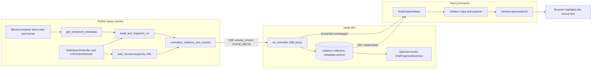
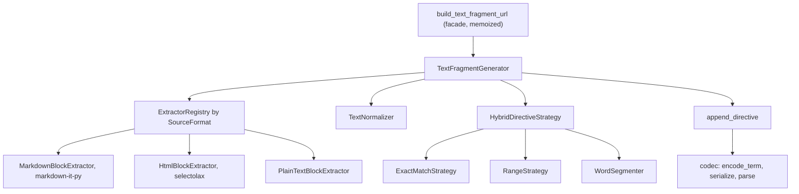
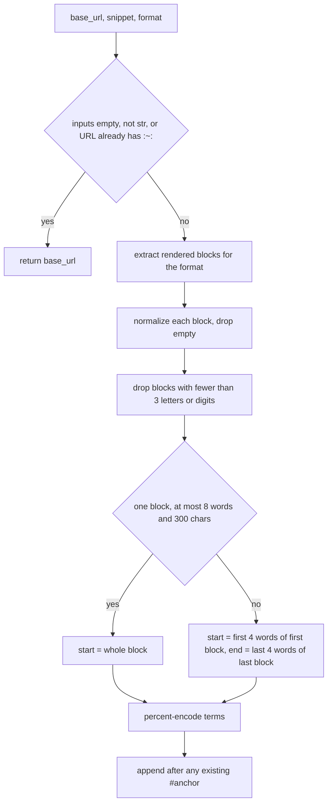

# Text fragments

How PipesHub turns a cited block of text into a link that highlights that text on the source page (`https://site/page#:~:text=...`), and how we know the link works.

Everything about building, parsing and stripping text directives lives in one package: `backend/python/app/utils/text_fragments/`. Callers use one function, `build_text_fragment_url`.

## Why this exists

The first implementation picked the first and last words of a block with an ASCII-only regex and `urllib.parse.quote`. That produced dead or wrong links:

- A word with a digit, hyphen, apostrophe, accent or non-Latin script (`Q3`, `e-mail`, `don't`, `Zürich`, Cyrillic, CJK) ended the matched run, so leading words were dropped. A single word produced no fragment.
- Stored block text is mostly markdown. The page shows no `**`, `[](...)`, `|`, `#` or `-` bullets, but the old code treated them as page text.
- A term can only match inside one rendered block (paragraph, list item, table cell). The old code could build a term that spanned two.
- `quote()` leaves `-` unencoded. An unencoded `-` in a term invalidates the whole directive.
- Fragments were stripped by looking for `#:~:text=`, which misses `url#anchor:~:text=...`, the form we produce when the URL already has an anchor.

## What a browser requires

From the [WICG text fragments spec](https://wicg.github.io/scroll-to-text-fragment/) and verified against Chromium (see [Verification](#verification)):

- Syntax: `#:~:text=[prefix-,]start[,end][,-suffix]`. A directive goes after any existing anchor (`#anchor:~:text=...`); everything after the first `:~:` belongs to the browser, not the page.
- Each term is percent-encoded UTF-8. `-`, `,` and `&` must be encoded (`%2D`, `%2C`, `%26`), or the directive is invalid.
- Matching ignores case and accents and collapses whitespace.
- A term must start and end on a word boundary (UAX #29) and must lie inside one rendered block.
- With a range, `end` is searched only after `start`.
- Chromium cannot match across a replaced element such as an image: it ends the run of text.

We emit no `prefix-` or `-suffix` terms. They exist to disambiguate repeated text, and we do not have the page DOM to choose them from.

## Data flow

Generation happens in the Python query service. Node and the frontend carry the URL unchanged.



The in-app preview highlights `citation.content` with its own fuzzy matcher (`frontend/app/components/file-preview/use-text-highlighter.ts`). It does not use the fragment.

Call sites in Python:

| Where | Source text | Format passed |
| --- | --- | --- |
| `chat_helpers.get_enhanced_metadata` | block `data` | `CODE` and `TABLE_ROW` blocks: plain; otherwise the block's `format` (`DataFormat`), default markdown. `RECORD_SUMMARY` and `IMAGE` blocks get no fragment |
| `citations._enrich_metadata_from_fragment` | joined child blocks of an image-split container | format of the children |
| `tool_handlers` (web search, fetched pages) | search snippets and page blocks | plain |
| `zoom/connector.py` | meeting topic | plain |

`citations._page_of`, `fetch_url_tool._resolve_tiny_ref_url` and the Slack bot (`stripFragmentDirective` in `slack-bot/src/utils/citations.ts`) all strip with the same rule: split on the first `:~:` and drop a trailing `#`, keeping any anchor before it.

## Design



### Generation flow



`build_url` never raises. When no directive can be built, or the base URL already carries one, it returns the base URL unchanged: a citation link without a highlight is still a working link.

### Modules

| Module | Responsibility |
| --- | --- |
| `models.py` | `TextDirective`, `SourceFormat` (and the `DataFormat` mapping), `TextFragmentConfig` |
| `codec.py` | Spec-conformant `encode_term`, `serialize`, `parse_text_directive`, `parse_fragment_directive` |
| `url.py` | `split_fragment_directive`, `strip_fragment_directive`, `append_directive`, `has_fragment_directive` |
| `normalize.py` | NFC, Unicode whitespace to a single space, removal of invisible characters (soft hyphen, zero-width space, bidi marks, BOM). ZWJ and ZWNJ are kept because they change shaping |
| `extractors.py` | `BlockTextExtractor` protocol; markdown, HTML and plain implementations; `ExtractorRegistry` |
| `segmentation.py` | `WordSegmenter`: splits a block into units whose edges are word boundaries |
| `strategies.py` | `DirectiveStrategy` protocol; `ExactMatchStrategy`, `RangeStrategy`, `HybridDirectiveStrategy` |
| `generator.py` | `TextFragmentGenerator`: wires the stages; every collaborator is injectable |
| `cache.py`, `facade.py` | `TtlCache` and `ttl_memoize`; the memoized `build_text_fragment_url` (key: base URL, SHA-1 of the snippet, format) |
| `cli.py` | Debug CLI |

### Extraction rules

Selection starts from rendered blocks, not from the raw string.

- **Markdown** (markdown-it, commonmark with tables and strikethrough): one block per paragraph, heading, list item, table cell and code-fence line. Link text and inline code are kept; link targets, emphasis markers, `#`, bullets and `|` are not text. Soft breaks become spaces; hard breaks and `<br>` start a new block. Images contribute no text and **end the block** (see below). Raw HTML blocks go through the HTML extractor.
- **HTML** (selectolax): block-level tags separate blocks. `script`, `style`, `head`, `noscript`, `template` and hidden elements (`hidden`, `display:none`, `visibility:hidden`) are skipped. Replaced and form-control elements (`img`, `svg`, `video`, `iframe`, `input`, `button`, ...) end the block.
- **Plain**: split on line breaks and on an ellipsis (`...` or `…`), which search snippets use to join separate passages.

Unknown formats are treated as markdown because most stored block text is markdown.

### Word segmentation

A term has to begin and end on a word boundary. For space-delimited scripts that holds at every whitespace edge once surrounding punctuation is trimmed, so a unit is a whitespace token trimmed to its first and last word character (letters, digits, `_`, combining marks). Tokens with no word character (`—`, `|`, `-`) are not units, but stay inside a term when they sit between units.

Scripts written without spaces (CJK, Thai, Lao, Myanmar, Khmer) need a dictionary to find word boundaries, and we do not have one. For them a unit is a run of word characters between punctuation, and a term is never cut inside a unit.

### Strategy and thresholds

| Setting | Default | Why |
| --- | --- | --- |
| `exact_max_words` | 8 | Exact match is preferred by the spec: the URL still says what was being looked for if the page changes. Kept short because block text comes from parsed content, not the live DOM, so a long exact string breaks on any rendering difference |
| `exact_max_chars` | 300 | The spec's practical limit |
| `range_term_words` | 4 | Long enough to be distinctive, short enough to survive small edits and keep URLs small for LLM copying |
| `min_term_alnum_chars` | 3 | Blocks with less are skipped: they match too much (`Hi`, `1.`) |
| `cjk_term_chars` | 10 | Budget for unspaced scripts; a term stops once it holds this many such characters |

Exact match applies to a single short block. Anything longer, or spread over several blocks, becomes a range: `start` is the first words of the first block and `end` the last words of the last block, each inside its own block. If a single block is too short to hold two disjoint terms, the whole block is quoted instead.

### Encoding

`encode_term(term) = quote(term, safe="").replace("-", "%2D")`. The result is ASCII only. Parentheses, brackets and spaces are encoded too, which keeps URLs intact inside markdown links (`[N](url)`) and safe for an LLM to copy.

## Verification

Four independent layers, each able to fail on its own.

| Layer | Where | What it proves |
| --- | --- | --- |
| Unit | `backend/python/tests/unit/utils/text_fragments/` | Each module, plus the never-raises and base-URL passthrough contracts |
| Property (Hypothesis) | `.../test_properties.py` | For arbitrary Unicode: output is ASCII, parses back to exactly one directive, every term lies in one rendered block on word boundaries, `end` follows `start`, encoding round-trips |
| Golden corpus + reference matcher | `backend/python/tests/fixtures/text_fragments/`, `tests/support/text_fragment_matcher.py` | URLs are stable, and an independent implementation of the spec's matching highlights what we meant |
| Real browser | `frontend/tests/text-fragments/` | Chromium agrees, and so does the `text-fragments-polyfill` |

The golden test file also runs the real HTML parser (`HtmlToBlocksConverter`) over each fixture page and checks that every block it emits is highlightable on its own page through the call-site format choice. That is what keeps the fixtures honest about what production parsing produces. It also checks the markdown extractor against the markdown-it HTML renderer.

The reference matcher is written separately from the generator (its own block walk, accent folding and word boundaries), so a bug in one cannot hide behind the same bug in the other. It has its own tests showing it rejects broken directives.

### Findings the browser suite produced

- An image inside a paragraph stops Chromium's text matching. A term built across the image does not highlight. Extractors therefore end the block at an image, and the reference matcher models the same.
- Chromium matches text containing NBSP and zero-width characters after we normalize them. The polyfill does not fold them, so that one corpus case is skipped for the polyfill and checked natively.
- A directive with an unencoded `-` paints nothing in Chromium; the suite keeps that as a control.

### Running

```bash
cd backend/python && source venv/bin/activate
pytest tests/unit/utils/text_fragments

cd frontend
npx playwright install chromium     # once
npm run test:text-fragments

scripts/verify.sh frontend          # includes the browser suite when Chromium is installed
```

`verify.sh` reports the browser suite as `skip` with the reason when the Playwright Chromium build is missing.

### Golden corpus workflow

`cases.json` holds one case per behaviour: `fixture` (an HTML page under `html/`), `format`, `snippet` (the block text as PipesHub stores it), optional `base_url`, `expected_url` (snapshot) and `expected_highlight` (what a browser must mark).

```bash
python scripts/text_fragments/regen_golden.py             # report drift, exit 1 if any
python scripts/text_fragments/regen_golden.py --update    # rewrite expected_url snapshots
python scripts/text_fragments/regen_golden.py --bootstrap # also fill expected_highlight for new cases
```

`expected_url` is a snapshot of generator output; refresh it when behaviour changes on purpose. `expected_highlight` is the oracle: it is written only for new cases (`--bootstrap`), and you must read it and confirm it is what a person would expect to see marked. To add a case, add the page text to a fixture, add an entry with null `expected_*`, run `--bootstrap`, review the printed highlight, then run the Python and browser suites.

## Debugging a bad link

```bash
cd backend/python
python -m app.utils.text_fragments.cli \
  --url https://example.com/page --format markdown --snippet-file snippet.txt --html page.html
```

It prints the rendered blocks, the chosen directive, the URL and, with `--html`, what the reference matcher highlights. Compare `blocks` with what the page actually renders: a mismatch there is almost always the cause.

## Known limits

- Table rows are cited with `row_natural_language_text` (`Name: Ada, Role: Engineer`), which contains header labels that are not on the page. A fragment built from it will not match on a web page. Fixing it means building the directive from the row's cell values.
- The real HTML parser indexes some text a reader never sees (`<title>`, hidden elements). A citation to that text cannot be highlighted.
- URLs already stored in Mongo keep their old form. Lookup in `citations.py` happens within one request, so generation and lookup always use the same algorithm.
- No `prefix-` or `-suffix` context terms, so text repeated on a page highlights its first occurrence.
