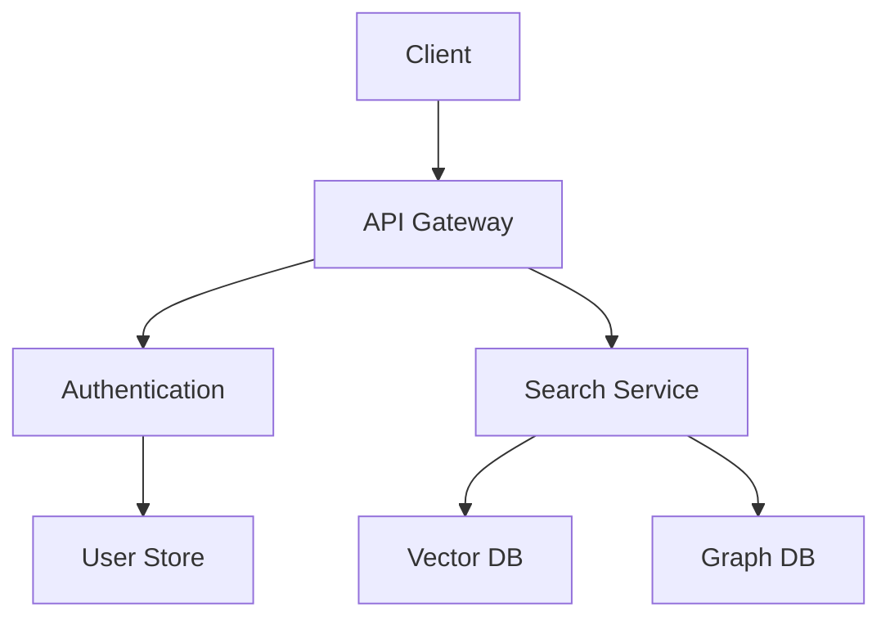

# Distributed Knowledge Processing System

## Table of Contents

1. Introduction
2. Architecture

# 1. Introduction

The Distributed Knowledge Processing System (DKPS) is a scalable platform designed for ingesting, processing, indexing, and querying structured and unstructured information.

## Features

- Horizontal scalability
- Distributed execution
- Fault tolerance
- Streaming ingestion
- Semantic search
- Graph-based storage
### Supported Formats

| Format | Supported | Notes |
|---------|---------|---------|
| JSON | Yes | Native |
| XML | Yes | Parsed |
| YAML | Yes | Converted |
| CSV | Yes | Tabular |
| PDF | Partial | OCR Required |

### Mathematical Model

$$
Score(d,q)=\alpha \cdot BM25(d,q)+\beta \cdot EmbeddingSimilarity(d,q)
$$

Inline formula: $F(x)=x^2+3x+2$

---

# 2. Architecture

```text
                  +----------------+
                  | Load Balancer  |
                  +-------+--------+
                          |
          +---------------+---------------+
          |                               |
+---------v---------+          +----------v---------+
| Ingestion Cluster |          | Query Cluster      |
+---------+---------+          +----------+---------+
          |                               |
          +---------------+---------------+
                          |
                +---------v---------+
                | Storage Layer     |
                +-------------------+
```

## Component Hierarchy

- Core
  - Scheduler
    - Task Queue
    - Worker Pool
  - Storage
    - Graph Store
    - Vector Store
    - Blob Store
  - Search
    - Lexical Engine
    - Semantic Engine

### Mermaid Diagram

